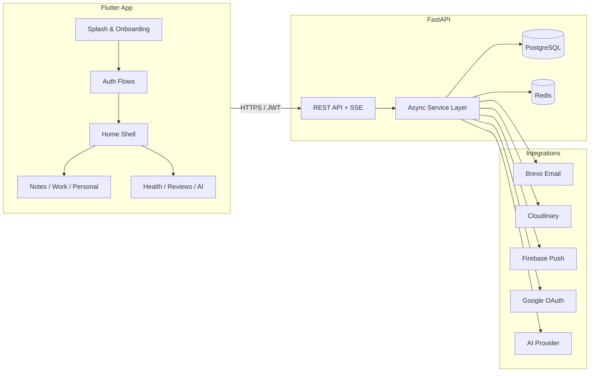
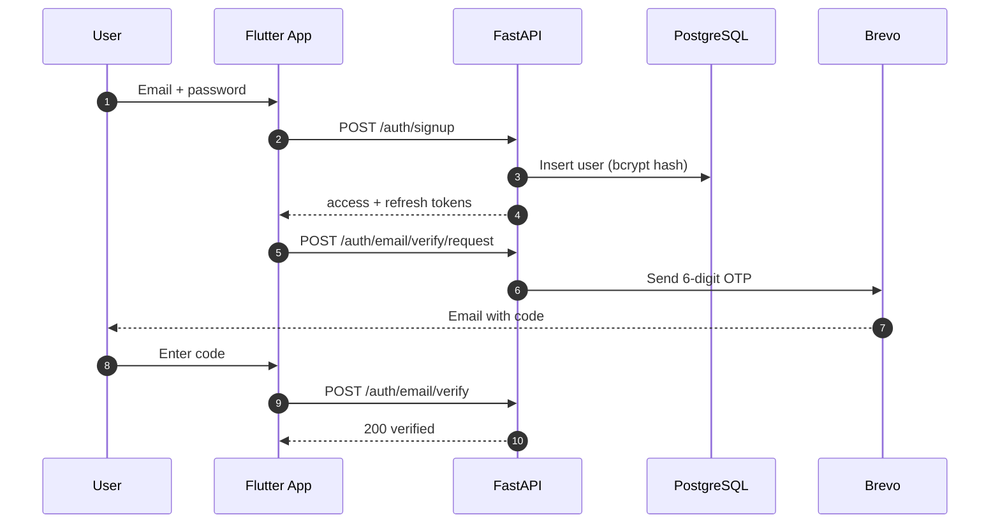
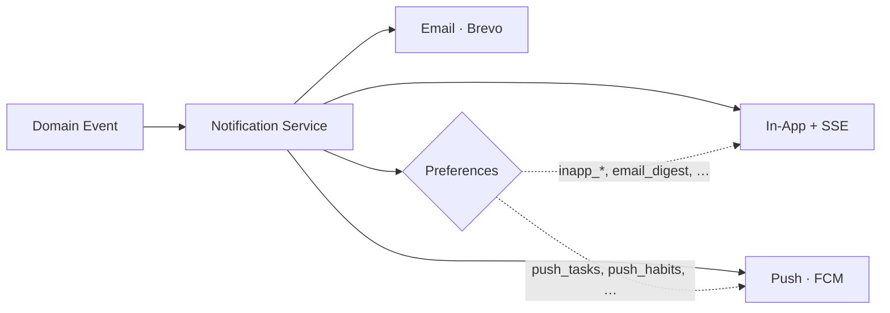

<div align="center">


<h3>A more intentional you.</h3>

<p>Organize your knowledge, work, life, health —<br/>and everything in between.</p>

<p>
  <a href="https://flutter.dev"></a>
  <a href="https://fastapi.tiangolo.com"></a>
  <a href="https://www.postgresql.org"></a>
  <a href="https://redis.io"></a>
</p>

<p>
  
  
  
  
</p>

</div>

---

**VIVRE** is a full-stack personal operating system — a calm, focused space to plan your day, capture knowledge, run your work, track your health, and reflect on your progress. Built as a Flutter client on a FastAPI + PostgreSQL + Redis backend, designed to stay fast and consistent for tens of thousands of daily active users.

---

## 📖 Table of Contents

- [Why VIVRE](#-why-vivre)
- [Feature Matrix](#-feature-matrix)
- [Architecture](#-architecture)
- [Tech Stack](#-tech-stack)
- [Repository Layout](#-repository-layout)
- [Getting Started](#-getting-started)
- [Environment Variables](#-environment-variables)
- [API Reference](#-api-reference)
- [Design System](#-design-system)
- [Security Model](#-security-model)
- [Performance & Scale](#-performance--scale)
- [Realtime & Notifications](#-realtime--notifications)
- [Testing & Quality](#-testing--quality)
- [Build & Deploy](#-build--deploy)
- [Roadmap](#-roadmap)
- [License](#-license)

---

## ✨ Why VIVRE

> **One calm space.** Most people run their lives across a dozen disconnected apps. VIVRE unifies notes, work, personal goals, health, reviews, and AI reflection into a single, intentional surface.

- **Intentional by design** — a quiet, focused UI with one accent color, generous whitespace, and zero clutter.
- **Everything in one place** — knowledge, work, life, health, time, and reviews unified under one timeline.
- **Reflective, not just productive** — daily and weekly reviews, progress tracking, and AI-assisted insight.
- **Built to last** — async-first backend, pooled connections, Redis caching, SSE realtime, and hardened auth.

---

## 🧭 Feature Matrix

| Module | Description | API | App |
|:--|:--|:--:|:--:|
| 🔐 **Authentication** | Email + Google, JWT sessions, OTP email verification, password reset | ✅ | ✅ |
| 🎬 **Onboarding & Splash** | Choreographed 3.3s splash, 3-page onboarding, parallax, spring motion | — | ✅ |
| 🏠 **Home Shell** | Top bar, notched bottom nav, greeting, daily quote | — | ✅ |
| 📝 **Notes** | Knowledge capture and organization | ✅ | 🚧 |
| 💼 **Work** | Projects, tasks, clients, milestones | ✅ | 🚧 |
| 🌿 **Personal** | Goals, habits, journal entries | ✅ | 🚧 |
| ❤️ **Health** | Health tracking and trends | ✅ | 🚧 |
| 📊 **Reviews** | Daily and weekly reviews | ✅ | 🚧 |
| ✨ **AI** | Assistant, summaries, reflection | ✅ | 🚧 |
| 🔔 **Notifications** | In-app, push, email + SSE live stream | ✅ | 🚧 |
| 🗓 **Timeline** | Unified day view across all modules | ✅ | 🚧 |
| 🔍 **Global Search** | Cross-entity search (notes, tasks, goals, events…) | ✅ | 🚧 |
| 👤 **Profile & Avatar** | Profile edits, Cloudinary avatars, Google connections | ✅ | ✅ |

**Legend:** ✅ shipped · 🚧 in progress

---

## 🏗 Architecture



### Authentication flow



**Design principles**

- **Async-first** — every I/O path (DB, Redis, email, storage, OAuth) is non-blocking.
- **Thin routes, fat services** — routers validate and delegate; services own business logic.
- **One error envelope** — every failure returns `{"error": {"code", "message"}}` — the client maps this to typed `ApiException` values.
- **Production invariants enforced at boot** — wildcard CORS, short secrets, or a missing encryption key fail startup, not runtime.

---

## 🧰 Tech Stack

### Backend

| Layer | Technology | Purpose |
|:--|:--|:--|
| Framework | **FastAPI** (ASGI) | REST API + SSE streaming |
| Language | **Python 3.11+** | Type-hinted, async-first |
| Database | **PostgreSQL** + SQLAlchemy (async, asyncpg) | Durable relational store |
| Cache / Broker | **Redis** | Caching, rate-limit backing, SSE pub/sub |
| Auth | **JWT** (HS256) + **bcrypt** | Access/refresh tokens, password hashing |
| Email | **Brevo** | OTPs, alerts, digests |
| Storage | **Cloudinary** | Avatar uploads |
| Push | **Firebase Cloud Messaging** | Mobile push notifications |
| Rate limiting | **slowapi** | Per-route limits (auth, AI) |
| Config | **pydantic-settings** | Typed env config + production validation |

### App

| Layer | Technology | Purpose |
|:--|:--|:--|
| Framework | **Flutter 3.19+** (Dart 3.3+) | iOS + Android from one codebase |
| HTTP | **Dio** | Typed client, interceptors, retries |
| Auth storage | **flutter_secure_storage** | Keychain / EncryptedSharedPreferences |
| Sign-in | **google_sign_in** | Google ID token flow |
| Config | **flutter_dotenv** | Bundled runtime config |
| Loading | **shimmer** | Skeleton loading states |
| Type | **google_fonts** (Nunito) + bundled **Inter** | Splash wordmark + app typography |

---

## 📁 Repository Layout

```
vivre/
├── app/                        # FastAPI backend package
│   ├── main.py                 # App factory, lifespan, exception handlers
│   ├── api/                    # Routers: auth · users · notes · work ·
│   │                           #   personal · health · reviews · ai ·
│   │                           #   notifications · shared
│   ├── core/                   # config · security · email · logging · middleware
│   ├── db/                     # session · redis · base · migrations runner
│   ├── models/                 # SQLAlchemy models
│   ├── schemas/                # Pydantic request/response schemas
│   ├── services/               # Business logic
│   └── integrations/           # Google · Cloudinary · Brevo · Firebase · AI
│
└── (Flutter app root)
    ├── pubspec.yaml
    ├── .env                    # Bundled runtime config (see below)
    └── lib/
        ├── main.dart           # Bootstrap + root routing
        ├── api/                # Dio client, ApiException, auth API + repository
        ├── app/                # Home shell, layout (top bar, bottom nav)
        ├── auth/               # Login · Register · OTP · Forgot/Reset password
        ├── onboarding/         # 3-page flow + shared widgets
        ├── splash/             # Animated launch sequence
        ├── motion/             # Spring curves
        ├── themes/             # Color palette, typography, spacing, theme
        └── widgets/            # Skeletons, feedback helpers
```

---

## 🚀 Getting Started

### Prerequisites

| Tool | Version |
|:--|:--|
| Python | 3.11+ |
| PostgreSQL | 14+ (Neon-compatible) |
| Redis | 7+ |
| Flutter | 3.19+ (Dart 3.3+) |
| Xcode / Android Studio | Latest stable |

### 1 · Backend

```bash
# Clone and enter the backend root
python -m venv .venv
source .venv/bin/activate        # Windows: .venv\Scripts\activate

pip install -r requirements.txt
cp .env.example .env             # then fill in the values
```

Database migrations run automatically on startup via the app lifespan — no manual step:

```bash
uvicorn app.main:app --reload
```

- Interactive API docs (development only): `http://localhost:8000/docs`
- Liveness: `GET /health` · Readiness (DB + Redis): `GET /health/ready`

### 2 · Flutter app

```bash
flutter pub get
cp .env.example .env             # API_BASE_URL, GOOGLE_WEB_CLIENT_ID, …

# Optional: regenerate launcher icons & splash
dart run flutter_launcher_icons
dart run flutter_native_splash:create

flutter run
```

> **Note:** `.env` is bundled as a Flutter asset — keep it out of public commits and rotate any value that leaks.

### 3 · Smoke checklist

1. Launch → splash → onboarding
2. Register → OTP email arrives → verify → land on Home
3. Switch bottom-nav tabs (Home / Notes / Work / Personal)
4. Sign out, sign back in with email/password
5. "Continue with Google" flow
6. Forgot password → OTP → reset → sign in with new password
7. Kill network mid-session → app stays logged in (no spurious logout)

---

## 🔐 Environment Variables

### Backend (`.env`)

| Variable | Required | Default | Description |
|:--|:--:|:--|:--|
| `ENVIRONMENT` | ✅ | `development` | `development` or `production` |
| `DATABASE_URL` | ✅ | — | PostgreSQL DSN (Neon-ready) |
| `REDIS_URL` | ✅ | — | Redis DSN |
| `JWT_SECRET_KEY` | ✅ | — | ≥ 32 chars enforced in production |
| `JWT_ALGORITHM` | — | `HS256` | Token signing algorithm |
| `ACCESS_TOKEN_EXPIRE_MINUTES` | — | `15` | Access token lifetime |
| `REFRESH_TOKEN_EXPIRE_DAYS` | — | `30` | Refresh token lifetime |
| `CLOUDINARY_CLOUD_NAME` / `API_KEY` / `API_SECRET` | ✅ | — | Avatar uploads |
| `BREVO_API_KEY` / `FROM_EMAIL` / `FROM_NAME` | ✅ | — | Transactional email |
| `FIREBASE_SERVICE_ACCOUNT_JSON` | — | — | Push notifications (JSON or file path) |
| `GOOGLE_CLIENT_ID` / `CLIENT_SECRET` / `REDIRECT_URI` | prod ✅ | — | Google OAuth |
| `TOKEN_ENCRYPTION_KEY` | prod ✅* | — | *Required when Google integration is enabled |
| `AI_PROVIDER` / `AI_PROVIDER_API_KEY` / `AI_MODEL_NAME` | — | `openai` | AI features |
| `CORS_ORIGINS` | prod ✅ | `""` | Comma-separated; wildcard rejected in production |
| `AUTH_RATE_LIMIT` | — | `5/minute` | Auth route limit |
| `AI_RATE_LIMIT` | — | `20/minute` | AI route limit |
| `DATABASE_POOL_SIZE` / `MAX_OVERFLOW` | — | `10` / `5` | Connection pool tuning |
| `DEFAULT_PAGE_SIZE` / `MAX_PAGE_SIZE` | — | `20` / `100` | Pagination bounds |
| `OTP_LENGTH` / `TTL` / `RESEND_COOLDOWN` / `MAX_ATTEMPTS` | — | `6` / `600s` / `60s` / `5` | OTP policy |

### App (`.env`)

| Variable | Required | Default | Description |
|:--|:--:|:--|:--|
| `API_BASE_URL` | ✅ | `https://vevre.onrender.com` | Backend base URL |
| `API_TIMEOUT_SECONDS` | — | `15` | Dio connect/receive/send timeout |
| `ENABLE_API_LOGGING` | — | `false` | Verbose request logging |
| `GOOGLE_WEB_CLIENT_ID` | Google ✅ | `""` | OAuth server client ID |

---

## 🔌 API Reference

All endpoints return the same error envelope on failure:

```json
{
  "error": { "code": "validation_error", "message": "Request validation failed" }
}
```

### Auth — `/auth` (rate-limited, public)

| Method | Endpoint | Description |
|:--:|:--|:--|
| `POST` | `/auth/signup` | Create account, returns token pair |
| `POST` | `/auth/login` | Email + password login |
| `POST` | `/auth/google` | Login / signup with Google ID token |
| `POST` | `/auth/refresh` | Rotate access + refresh tokens |
| `POST` | `/auth/logout` | Revoke refresh session |
| `POST` | `/auth/email/verify/request` | Send verification OTP |
| `POST` | `/auth/email/verify` | Confirm email with OTP |
| `POST` | `/auth/password/forgot` | Send password reset OTP |
| `POST` | `/auth/password/reset` | Reset password with OTP |

### Users — `/users` (Bearer)

| Method | Endpoint | Description |
|:--:|:--|:--|
| `GET` | `/users/me` | Current profile |
| `PATCH` | `/users/me` | Update name / timezone |
| `POST` | `/users/me/avatar` | Upload avatar (Cloudinary) |
| `DELETE` | `/users/me/avatar` | Remove avatar |
| `GET` | `/users/me/google/authorize-url` | Start Google OAuth |
| `GET` | `/users/me/google` | Connection status |
| `GET` | `/users/me/google/callback` | OAuth callback (state-token protected) |
| `DELETE` | `/users/me/google` | Disconnect Google |

### Shared

| Method | Endpoint | Auth | Description |
|:--:|:--|:--:|:--|
| `GET` | `/health` | Public | Liveness probe |
| `GET` | `/health/ready` | Public | Readiness (DB + Redis) |
| `GET` | `/timeline?date=` | Bearer | Unified day timeline |
| `GET` | `/search?q=&limit=&offset=` | Bearer | Cross-entity search |

### Notifications — `/notifications` (Bearer)

| Method | Endpoint | Description |
|:--:|:--|:--|
| `GET` | `/notifications` | Paginated list (`?unread_only=`) |
| `GET` | `/notifications/stream` | SSE live stream (Redis pub/sub, 15s heartbeat) |
| `PATCH` | `/notifications/{id}/read` | Mark one read |
| `POST` | `/notifications/read-all` | Mark all read |
| `GET` / `PATCH` | `/notifications/preferences` | Read / update preferences |
| `POST` / `DELETE` | `/notifications/device-tokens` | Register / unregister FCM token |

### Feature modules

Full CRUD surfaces live under `/notes`, `/work`, `/personal`, `/health`, `/reviews`, and `/ai`. Explore them interactively at `/docs` in development (disabled in production).

---

## 🎨 Design System

> **One accent. Calm surfaces. Generous whitespace.**

### Brand

| Swatch | Token | Hex | Usage |
|:--:|:--|:--|:--|
|  | `primary` | `#2C67C5` | Actions, links, focus rings |
|  | `navy` | `#16233D` | Headings, brand ink |
|  | `page` | `#F7FAFD` | Onboarding/auth background |
|  | `gray` | `#6B7280` | Body copy, captions |

### Core palette — light *(dark parity defined)*

| Swatch | Token | Hex | Usage |
|:--:|:--|:--|:--|
|  | `background` | `#F6F7F9` | App canvas |
|  | `surface` | `#FFFFFF` | Cards, sheets |
|  | `surfaceSoft` | `#EEF1F5` | Fields, skeletons |
|  | `border` | `#DDE2E9` | Dividers, outlines |
|  | `textPrimary` | `#171A21` | Titles |
|  | `textSecondary` | `#5F6877` | Body |
|  | `textMuted` | `#8992A0` | Hints, meta |
|  | `primarySoft` | `#E8F0FF` | Accent fills |
|  | `success` | `#4F7F5B` | Done, on-track |
|  | `dueSoon` | `#A8792F` | Due soon |
|  | `overdue` | `#A94D3D` | Overdue, errors |
|  | `aiFocus` | `#7957C7` | AI surfaces |

### Typography — Inter

| Token | Size / Weight | Usage |
|:--|:--|:--|
| `displayLarge` | 34 · w800 | Hero moments |
| `displaySmall` | 24 · w700 | Screen titles |
| `headlineMedium` | 20 · w700 | Section heads |
| `titleLarge` | 16 · w600 | Buttons, list titles |
| `bodyLarge` | 15 · w400 | Primary copy |
| `bodySmall` | 13 · w400 | Secondary copy |
| `labelSmall` | 11 · w500 | Nav labels, meta |

> The splash wordmark uses **Nunito w900** for brand contrast.

### Space & Shape

| Scale | Values |
|:--|:--|
| Spacing | `4 · 8 · 12 · 16 · 20 · 24 · 32 · 40 · 48 · 64` |
| Radius | `8 · 12 · 14 · 16 · 20 · 24 · 26 · pill` |

### Motion

- **`AppSprings.snap` / `AppSprings.settle`** — custom sampled spring curves for natural deceleration.
- **Splash** — 3.3s choreography: mark rise → leaf grow → letter stagger → lockup settle, with haptics and skip support.
- **Onboarding** — snappy page physics, parallax scaling, animated indicator morph.
- **Loading** — shimmer skeletons over soft surfaces; content-first, never blank.

---

## 🔒 Security Model

| Area | Implementation |
|:--|:--|
| Passwords | bcrypt (12 rounds) over a SHA-256 pre-hash — no length ceiling from bcrypt |
| Tokens | JWT HS256 · 15-min access · 30-day refresh with `sid` (session) + `jti` — refresh rotation & server-side revocation |
| Session recovery | Single-flight refresh with retry; logout **only** on a definitive 401 — transient network failures never log users out |
| OTP | 6 digits · 10-min TTL · 60s resend cooldown · max 5 attempts |
| OAuth state | Short-lived signed state token (600s) — callback cannot be replayed |
| Token-at-rest | Google refresh tokens encrypted via `TOKEN_ENCRYPTION_KEY` |
| Device | Access + refresh tokens in Keychain / EncryptedSharedPreferences — never in plain prefs |
| Rate limits | `5/min` auth · `20/min` AI (configurable per environment) |
| Production gates | Startup fails on: wildcard CORS, JWT secret < 32 chars, missing Google config, missing encryption key |
| Surface discipline | API docs, ReDoc, and OpenAPI schema disabled in production |
| Request hygiene | Body-size caps, image MIME allow-list, chunked uploads with byte ceilings |

---

## 📈 Performance & Scale

Engineered for **tens of thousands of daily active users** without degradation:

| Area | Strategy |
|:--|:--|
| Async I/O | Entire request path is non-blocking (SQLAlchemy async + asyncpg, async Redis, thread-offloaded heavy calls) |
| Pooling | Tuned pool (`size 10`, `overflow 5`, 30-min recycle, 30s acquisition timeout) with per-statement timeout (60s) |
| Caching | Redis-backed user cache (60s TTL) invalidated on profile/avatar mutation |
| Realtime | SSE fan-out via Redis pub/sub — one subscription per client, heartbeats keep proxies honest |
| Pagination | Default 20 / max 100 items across all list endpoints — no unbounded reads |
| Email | Digest dispatch in batches (500/batch), not per-user loops |
| Push | Device-token registry with capped delivery attempts (5) and failure timestamps |
| Client | Token cache eliminates per-request secure-storage I/O · single-flight refresh (no refresh storms on 401 bursts) |
| Delivery | Lean error envelopes, no debug output in release, docs disabled in production |

---

## 🔔 Realtime & Notifications

Three channels, one pipeline:



- **In-app** — paginated feed + live SSE stream (`/notifications/stream`), 15s heartbeat, auto-reconnect.
- **Push** — Firebase Cloud Messaging via registered device tokens.
- **Email** — Brevo transactional: verification, password alerts, weekly digest, daily review reminders.
- **Preferences** — granular toggles per module (tasks, habits, reviews, goals, milestones) × channel.

---

## 🧪 Testing & Quality

```bash
# Flutter
flutter analyze          # static analysis — zero warnings policy
flutter test             # widget + unit tests

# Backend
pytest                   # async test suite
ruff check app           # lint (if configured)
```

**Conventions**

- One responsibility per file; exactly one header comment: the file path.
- Errors always surface as typed `ApiException` on the client — never raw strings.
- Every user-facing failure has a friendly message and a recovery path.
- Design tokens only — no hardcoded colors or sizes in screens.

---

## 📦 Build & Deploy

### Backend (any ASGI host — e.g. Render)

```bash
uvicorn app.main:app --host 0.0.0.0 --port $PORT
```

Boot sequence: configure logging → run migrations → register notification handlers → serve. Health probes: `/health` (liveness), `/health/ready` (DB + Redis readiness).

### App

```bash
flutter build appbundle --release     # Android
flutter build ipa --release           # iOS
```

Before release:

- [ ] `.env` points at the production `API_BASE_URL`
- [ ] `ENABLE_API_LOGGING=false`
- [ ] `GOOGLE_WEB_CLIENT_ID` matches the backend Google OAuth client
- [ ] Launcher icons + splash regenerated
- [ ] Smoke checklist passed (see [Getting Started](#-getting-started))

---

## 🗺 Roadmap

- [x] Email + Google authentication · OTP verification · password reset
- [x] Design system foundation (palette · typography · spacing · motion)
- [x] Notifications API with SSE live stream
- [x] Timeline + global search APIs
- [ ] Home module UIs — Notes, Work, Personal, Health, Reviews
- [ ] AI assistant surfaces
- [ ] Dark mode rollout across all screens
- [ ] Timeline & search UI
- [ ] Offline cache with optimistic sync

---

## 📄 License

**Proprietary — all rights reserved.** This repository is not licensed for redistribution or reuse. Contact the maintainers for access or partnership.

---

<div align="center">


<sub><strong>Built with care. Ship calm.</strong></sub>

</div>